# MyKaKaoTalk

Java Swing과 MultiThread Socket, JDBC(MySQL) 을 이용하여 카카오톡(구버전) 을 구현해 보았습니다.

## 기능

* 회원 등록
* 친구 검색
* 친구 추가/삭제
* 프로필 수정
* 채팅방 개설
* 채팅방 참가/나가기
* 채팅방 대화 친구 추가

# 설명

좌측) 로그인 화면  우측) 회원가입 화면

메인화면

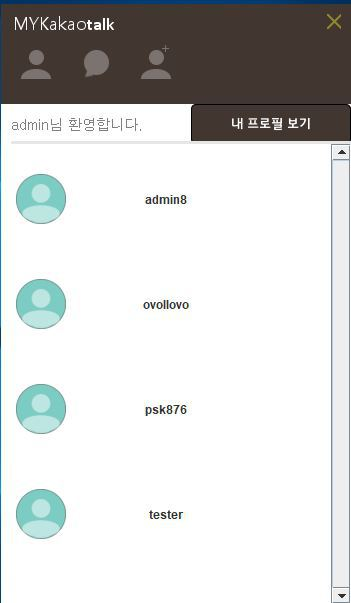

좌측) 채팅방 설정  우측) 채팅방 리스트 

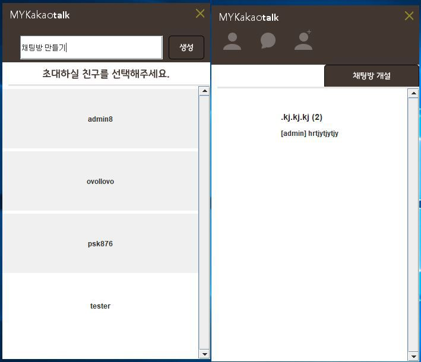

친구 추가 좌측) admin1 계정 우측) admin 계정

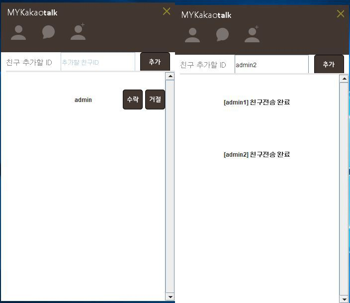

좌측) 본인 계정 프로필 화면 우측) 친구 계정 프로필 화면

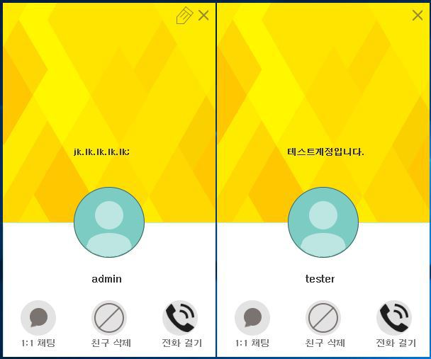

# DataBase

## MyKaKao DB Table

* addfriendlist

| Field | Type | Null | Key | Default | Extra |
|:-------|:-------|:-------|:-------|:-------|:-------|
| senderID | varchar(24) | NO | PRI | NULL |  |
| receiverID | varchar(24) | NO | PRI | NULL |  |

* chatlog

| Field | Type | Null | Key | Default | Extra |
|:-------|:-------|:-------|:-------|:-------|:-------|
| senderID | varchar(24) | NO | PRI | NULL |  |
| roomID | int(11) | NO | PRI | NULL |  |
| chatContent | varchar(100) | YES |  | NULL |  |
| chatTime | datetime | NO | PRI | 0000-00-00 00:00:00 |  |

* chattingroom

| Field | Type | Null | Key | Default | Extra |
|:-------|:-------|:-------|:-------|:-------|:-------|
| roomID | int(11) | NO | PRI | NULL |  |
| roomName | varchar(48) | NO | PRI | NULL |  |
| member | varchar(24) | NO | PRI | NULL |  |

* friend

| Field | Type | Null | Key | Default | Extra |
|:-------|:-------|:-------|:-------|:-------|:-------|
| userID | varchar(24) | NO | PRI | NULL |  |
| friendID | varchar(24) | NO | PRI | NULL |  |

* singlechat

| Field | Type | Null | Key | Default | Extra |
|:-------|:-------|:-------|:-------|:-------|:-------|
| senderID | varchar(24) | NO | PRI | NULL |  |
| roomID | int(11) | NO | PRI | NULL |  |
| chatContent | varchar(100) | YES |  | NULL |  |
| chatTime | datetime | NO | PRI | 0000-00-00 00:00:00 |  |

* user

| Field | Type | Null | Key | Default | Extra |
|:-------|:-------|:-------|:-------|:-------|:-------|
| userID | varchar(24) | NO | PRI | NULL |  |
| userPassword | varchar(24) |  | PRI | NULL |  |
| userName | varchar(16) | NO |  | NULL |  |
| userEmail | varchar(32) | NO |  | NULL |  |
| userTel | varchar(16) | NO |  | NULL |  |
| profile | varchar(32) | YES |  |  |  |

# Class Diagram

## Client

* client

* user

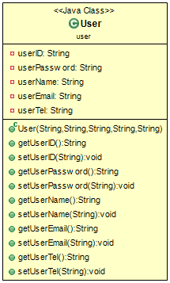

## Server

* server

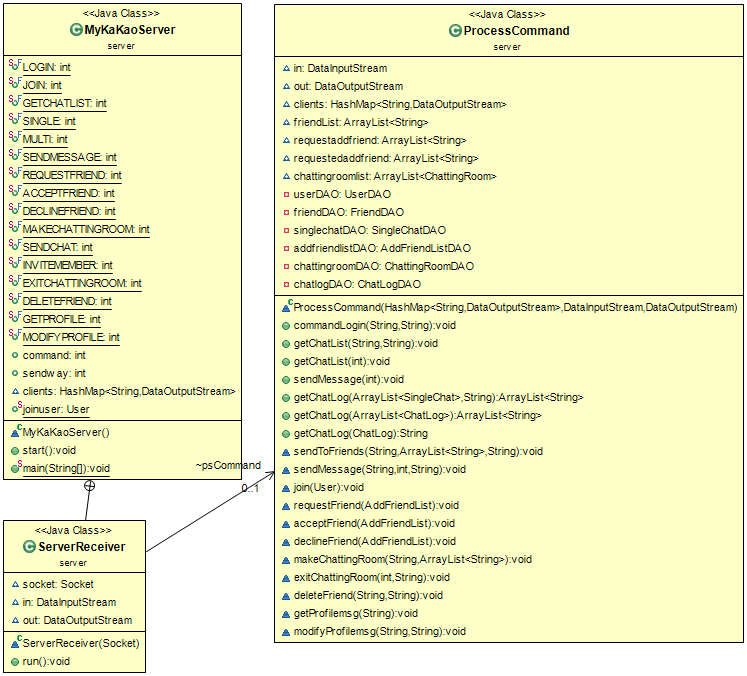

* addfriendlist

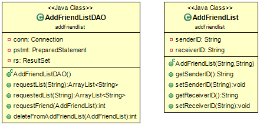

* chatlog

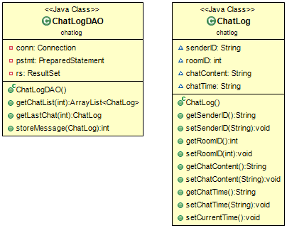

* chattingroom

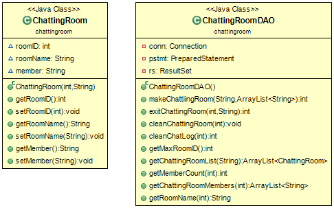

* friend

* singlechat

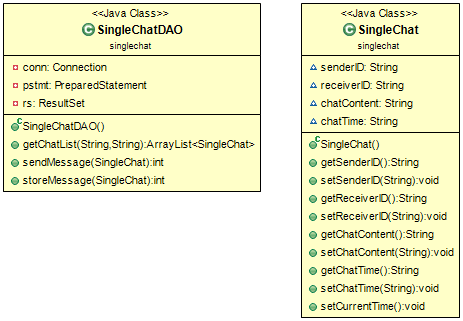

* user

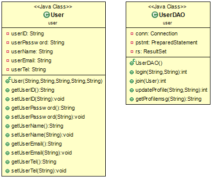
