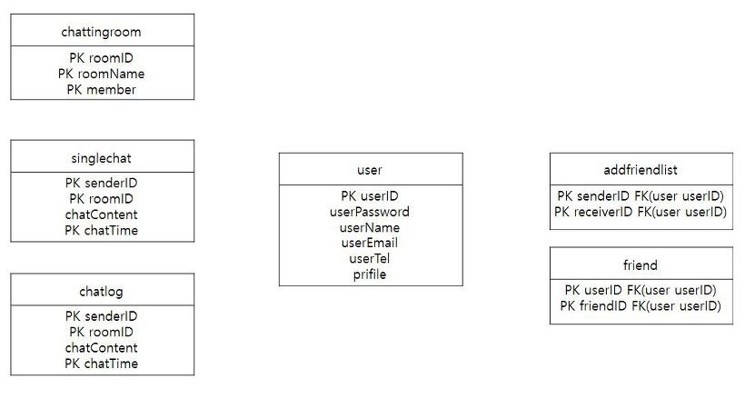
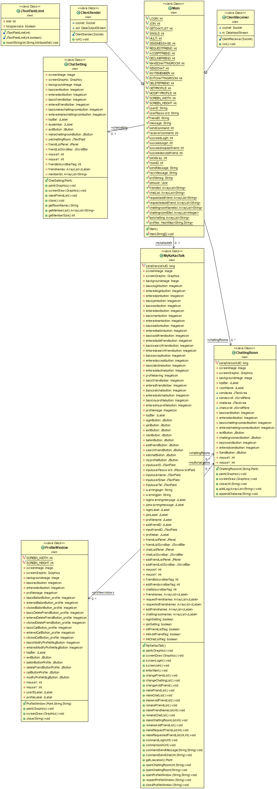
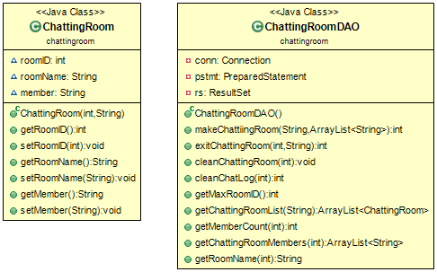
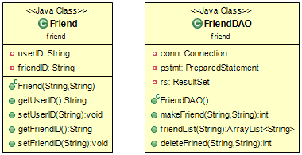
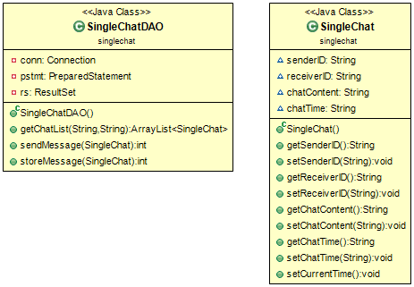
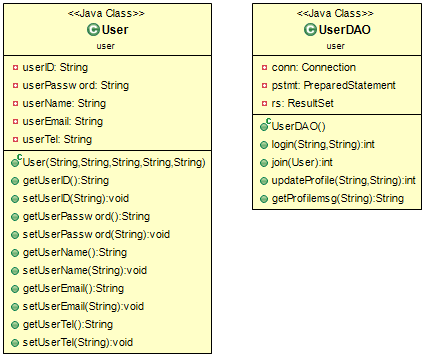

# MyKaKaoTalk

이클립스로 제작 했고 MySql 데이터베이스입니다.

## 영상

# DataBase

## MyKaKao DB Table

* addfriendlist

| Field | Type | Null | Key | Default | Extra |
|:-------|:-------|:-------|:-------|:-------|:-------|
| senderID | varchar(24) | NO | PRI | NULL |  |
| receiverID | varchar(24) | NO | PRI | NULL |  |

* chatlog

| Field | Type | Null | Key | Default | Extra |
|:-------|:-------|:-------|:-------|:-------|:-------|
| senderID | varchar(24) | NO | PRI | NULL |  |
| roomID | int(11) | NO | PRI | NULL |  |
| chatContent | varchar(100) | YES |  | NULL |  |
| chatTime | datetime | NO | PRI | 0000-00-00 00:00:00 |  |

* chattingroom

| Field | Type | Null | Key | Default | Extra |
|:-------|:-------|:-------|:-------|:-------|:-------|
| roomID | int(11) | NO | PRI | NULL |  |
| roomName | varchar(48) | NO | PRI | NULL |  |
| member | varchar(24) | NO | PRI | NULL |  |

* friend

| Field | Type | Null | Key | Default | Extra |
|:-------|:-------|:-------|:-------|:-------|:-------|
| userID | varchar(24) | NO | PRI | NULL |  |
| friendID | varchar(24) | NO | PRI | NULL |  |

* singlechat

| Field | Type | Null | Key | Default | Extra |
|:-------|:-------|:-------|:-------|:-------|:-------|
| senderID | varchar(24) | NO | PRI | NULL |  |
| roomID | int(11) | NO | PRI | NULL |  |
| chatContent | varchar(100) | YES |  | NULL |  |
| chatTime | datetime | NO | PRI | 0000-00-00 00:00:00 |  |

* user

| Field | Type | Null | Key | Default | Extra |
|:-------|:-------|:-------|:-------|:-------|:-------|
| userID | varchar(24) | NO | PRI | NULL |  |
| userPassword | varchar(24) |  | PRI | NULL |  |
| userName | varchar(16) | NO |  | NULL |  |
| userEmail | varchar(32) | NO |  | NULL |  |
| userTel | varchar(16) | NO |  | NULL |  |
| profile | varchar(32) | YES |  |  |  |

# Class Diagram

## Client

* client

* user

## Server

* server

* addfriendlist

* chatlog

* chattingroom

* friend

* singlechat

* user

